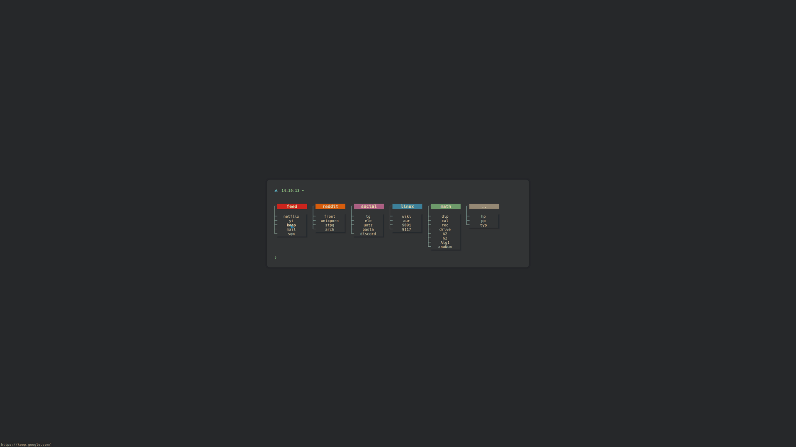

# startpage

A simple html startpage and [new tab](https://chrome.google.com/webstore/detail/change-new-tab/mocklpfdimiadpbgamlgehpgpodggahe "new tab extension").

## motivation

A part from the obvious aesthetics, I also made this so I could use **[Vimium](https://github.com/philc/vimium)** on a decent new tab, rather than pages/blank.html (see this [issue](https://github.com/philc/vimium/issues/1515 "issue link")).

## search bar
I use Vomnibar for most searches (my own bangs > duckduckgo's), but I have added in a "hidden" ddg search bar, which is focused by pressing `Space`. (it also takes autofocus, but if you use Vimium it only takes autofocus before vimium loads, so if you press `t` to open a new tab and then immediately start typing).

## [live preview](https://bachoseven.github.io/startpage/ "Live preview")

A possibly outdated preview:

## credits

- https://stpg.tk/guides/terminal-like-startpage for providing useful beginner guides
- https://github.com/Hungry-Hobo/Homepage for the boxes
- https://www.reddit.com/r/startpages/comments/f6hfoq/term_tree/ for the tree structure through CSS borders
