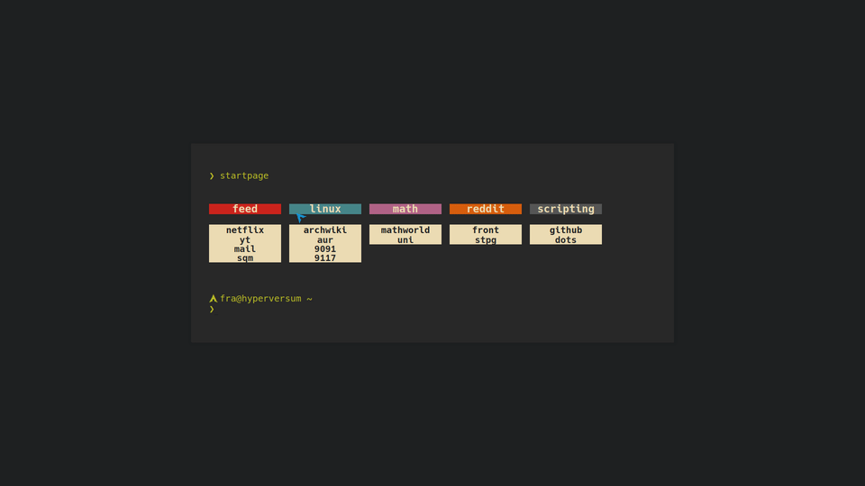

# startpage
A simple html startpage and [new tab](https://chrome.google.com/webstore/detail/change-new-tab/mocklpfdimiadpbgamlgehpgpodggahe "new tab extension").

I made it so I could use **[Vimium](https://github.com/philc/vimium)** on a decent new tab, instead of pages/blank.html (see this [issue](https://github.com/philc/vimium/issues/1515 "issue link")).

## Search Bar
I use Vomnibar for most searches (my own bangs > duckduckgo's), but I have added in a hidden ddg search bar (which only takes autofocus before vimium loads, so by pressing `t` and then immediately start typing).

# [preview](https://bachoseven.github.io/startpage/)

## credits

- https://stpg.tk/guides/terminal-like-startpage for setting up the homepage like a terminal
- https://github.com/Hungry-Hobo/Homepage for the boxes
